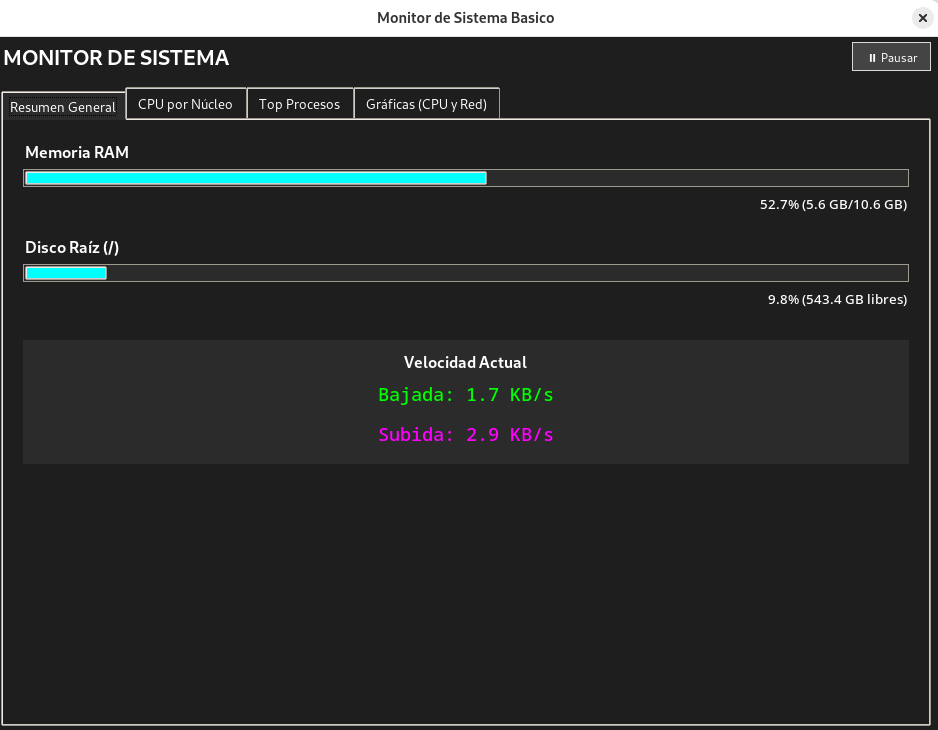
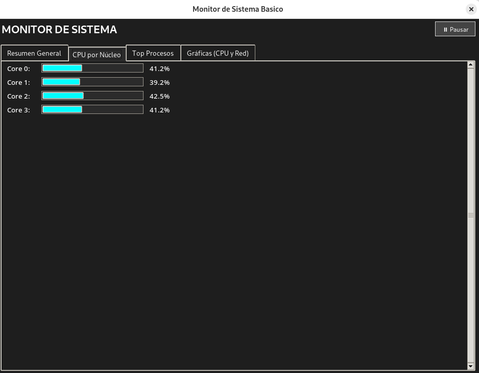
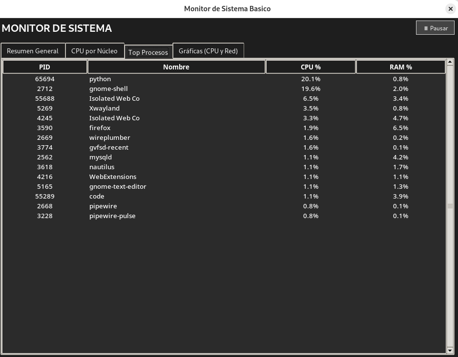
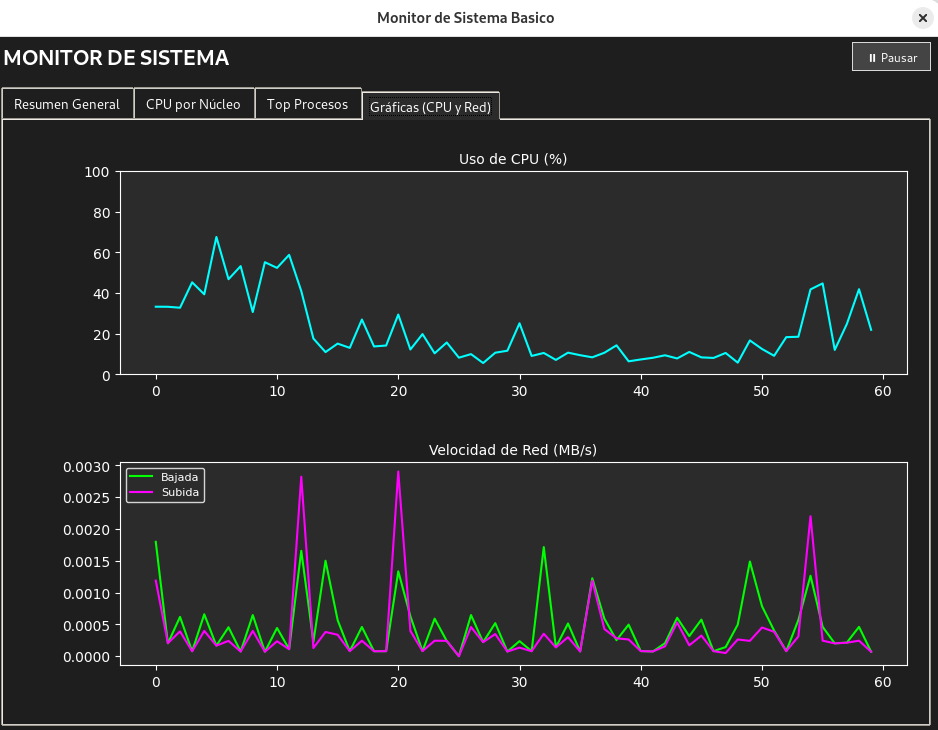

🖥️ Monitor de Sistema Básico (Python)

Herramienta de monitoreo de recursos del sistema en tiempo real, con interfaz gráfica (GUI), desarrollada como parte del curso de Sistemas Operativos en la Facultad de Ciencias, UNAM.

El monitor opera en espacio de usuario (user space) e interactúa con el kernel para obtener métricas del hardware mediante la librería psutil.

🚀 Características Principales

🔹 Interfaz Moderna

Diseño claro, organizado y con modo oscuro nativo.

Sistema de pestañas (Notebook) para separar métricas lógicamente.

🔹 Visualización en Tiempo Real

CPU: Carga Global y desglose por núcleo lógico (multicore).

Memoria RAM: Barra de progreso y valores exactos (GB usados / Totales).

Disco: Uso y espacio libre en la partición raíz (/).

Red: Velocidad de subida y bajada calculada mediante diferencial:

$$Velocidad = \frac{\Delta Bytes}{\Delta Tiempo}$$

🔹 Gráficas Históricas

Matplotlib embebido en Tkinter para graficar:

Historial de carga de CPU (%).

Historial de ancho de banda de red (MB/s) con auto-escalado.

🔹 Gestor de Procesos

Tabla con el Top 15 procesos ordenados por consumo de CPU.

Actualización optimizada (3s) para reducir el impacto del monitor en el sistema (Efecto del observador).

📸 Capturas de Pantalla

🛠️ Requisitos del Sistema

SO: Linux (Probado en Fedora/Ubuntu) o Windows 10/11.

Python: 3.8 o superior.

Librerías externas:

psutil – Acceso a métricas y syscalls del sistema.

matplotlib – Renderizado de gráficas históricas.

pillow – Backend gráfico para integraciones.

tkinter – GUI (Generalmente incluido en Python).

📦 Instalación y Uso

1. Clonar el repositorio

git clone [https://github.com/Daniiel314/Monitor-Sistema-SO.git](https://github.com/Daniiel314/Monitor-Sistema-SO.git)
cd Monitor-Sistema-SO

2. Instalar dependencias

Puedes usar un entorno virtual o instalarlas directamente:

pip install -r requirements.txt

3. Ejecutar la aplicación

python monitor_sistema.py

🔧 Solución de Problemas Comunes

❗ Error: ModuleNotFoundError: No module named 'tkinter' (Linux)
En algunas distribuciones de Linux, tkinter se instala por separado:

Debian/Ubuntu: sudo apt-get install python3-tk

Fedora: sudo dnf install python3-tkinter

❗ Error con PIL o ImageTk
Si las gráficas no cargan, fuerza la reinstalación de Pillow:

pip install --upgrade --force-reinstall pillow

🧠 Arquitectura y Funcionamiento

La aplicación utiliza el bucle principal de eventos (mainloop) de tkinter.

Concurrencia simulada: Para evitar bloqueos del hilo principal (UI congelada), se utiliza .after(ms, fn) para programar actualizaciones asíncronas de la interfaz.

Optimización CPU: Se realiza una única llamada por ciclo a psutil.cpu_percent(percpu=True) y se calcula el promedio global aritméticamente, reduciendo las llamadas al sistema.

Cálculo Diferencial de Red:

velocidad = (bytes_actuales - bytes_previos) / delta_tiempo

Esto permite obtener la velocidad instantánea sin depender de herramientas externas del SO.

✒️ Autor

Juan Daniel Barrera Holan

Facultad de Ciencias

Universidad Nacional Autónoma de México (UNAM)
